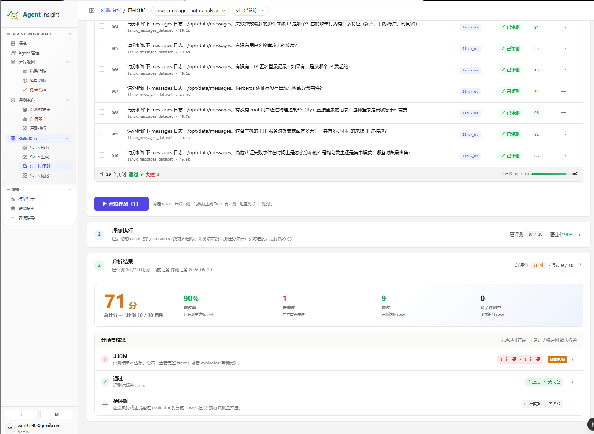

# 用例分析

用例分析用于对**某一个 Skill 的某一个版本**执行批量质量评测。系统将选中的 case 或 Trace 交由目标 Skill 执行或复用已有执行记录，再通过 **LLM Judge** 输出分数、通过率、分场景结果与逐条反馈，用于回答两个核心问题：

- 当前版本是否稳定达标
- 当前版本的问题集中在哪些结果或轨迹环节

> **Note**
> 用例分析同时覆盖**结果质量**与**执行轨迹**。发布判断通常需要与 **静态合规分析**、**触发分析** 与
> **A/B 测试** 结合解读，避免仅凭单一页面下结论。

## 模块定位

用例分析承担“验证结果是否正确、验证过程是否合理、定位异常样本与偏离场景”的职责，适用场景包括：

- Skill 已经被调用，但输出质量波动明显
- 同一类 query 的结果稳定性不足
- 需要核对执行过程中是否真实加载目标 Skill
- 需要从真实 Trace 中抽查问题样本
- 需要从标准数据集中执行版本回归

常见输出结论包括：

- 最终结果不达标
- 轨迹分析存在偏离
- 低分样本集中在少数场景
- 真实调用与预期结果不一致

## 核心术语

| 术语 | 含义 |
|---|---|
| **Skill / 版本** | 当前被评测的能力对象与目标版本。所有配置、评测和结果都绑定到当前版本。 |
| **评测任务** | 一次批量评测的归档容器。后续追加的评测记录会汇总到同一个批次中。 |
| **case** | 单条待测输入，是从数据集发起评测时的最小执行单位。 |
| **Trace** | 一次真实执行或历史执行的完整链路记录，包含输入、过程与输出。 |
| **数据集** | 作为评测参考集的 case 集合。系统按 query 匹配预期结果。 |
| **评估器** | 执行评分与诊断的裁判集合，可多选。 |
| **结果分析** | 面向最终输出质量的评估结果。 |
| **轨迹分析** | 面向执行过程、工具调用与链路合理性的评估结果。 |
| **高偏离** | 与预期结果或稳定路径存在明显偏差的 Trace 集合，适合作为优先排查对象。 |
| **通过 / 未通过 / 待评测** | case 或 Trace 在当前评测任务中的结果状态。 |
| **session id** | 单条执行记录的唯一标识，用于跳转到链路追踪查看完整执行过程。 |
| **taskId** | 执行任务标识，可用于检索指定 Trace。 |

## 页面总览

下图展示用例分析页在完成一轮评测后的典型界面。页面按 **① 配置 → ② 评测执行 → ③ 分析结果** 三段串行组织。

图中各区域的职责如下：

- **① 配置**：选择 **评测任务**、**数据集**、**评估器** 与 **用例来源**，并勾选待评测对象
- **开始评测**：启动当前勾选对象的批量评测流程
- **② 评测执行**：展示已启动记录、执行状态、执行 Trace、评估 Trace 与分数
- **③ 分析结果**：展示总评分、通过率、未通过数量、通过数量、待评测数量与 **分场景结果**

截图中的页面状态可解读为：

- 系统已完成 **10 / 10** 条用例评测
- 当前任务的 **总评分** 为 **71 分**
- 当前任务的 **通过率** 为 **90%**
- 当前任务存在 **1** 条 **未通过** 用例
- 当前任务存在 **9** 条 **通过** 用例
- 当前任务不存在 **待 / 评测中** 用例

## 页面分区功能

### ① 配置

**前提条件**

- 已进入目标 **Skill** 的目标 **版本**
- 已打开 **用例分析**

**预期结果**

- 页面进入可配置状态
- 当前评测对象、参考集与评测任务明确可见

该区域包含以下功能：

- **选择 / 新建评测任务**：绑定或创建当前批次
- **查看**：打开已绑定的 **评测任务** 详情
- **数据集**：选择作为评测参考集的 case 集合
- **评估器**：选择本次调用的评估器
- **用例来源**：在 **从 Trace** 与 **从数据集** 之间切换
- **开始评测**：启动当前勾选对象的评测流程

### ② 评测执行

**前提条件**

- 已在 **① 配置** 中完成勾选并启动评测

**预期结果**

- 页面持续展示进度与运行记录
- 记录支持跳转到执行链路与评测结果

该区域包含以下功能：

- **已评测 X / Y**：展示当前任务的完成进度
- **平均评分** 或 **通过率**：展示阶段性质量信号
- **执行 Trace**：打开被评测对象的执行链路
- **评估 Trace**：打开评估器的评分链路
- **状态**：展示 **排队中**、**执行中**、**评测中**、**部分评测**、**已评测**、**失败**
- **评测结果**：打开当前记录的评测结果详情
- **分数**：展示当前记录的综合分数
- **重试**：对失败记录重新发起评测

### ③ 分析结果

**前提条件**

- 已完成至少一条 case 或 Trace 的评测

**预期结果**

- 页面展示可用于决策的聚合结论
- 页面支持从汇总结果下钻到单条明细

该区域包含以下功能：

- **总评分**：汇总当前任务的整体得分
- **通过率**：展示已评测对象中的达标比例
- **未通过**：汇总需要优先处理的问题样本
- **通过**：汇总已达标样本
- **待评测**：汇总尚未完成评分的样本
- **分场景结果**：按通过状态聚合明细，并支持通过 **查看完整 trace** 下钻到单条样本

## 两种用例来源

| 维度 | **从数据集** | **从 Trace** |
|---|---|---|
| 评测对象 | 数据集中的 case | 已存在的 Trace |
| 是否先执行 Skill | 需要 | 不需要 |
| 典型用途 | 版本回归、标准题库验收 | 真实调用复盘、异常样本排查 |
| 可用筛选 | 用例列表、状态、搜索 | **全部**、**已评估**、**未评估**、**高偏离**、搜索 |
| 结果粒度 | 单条 case | 单条 Trace |

> **Tip**
> 做版本回归时优先选择 **从数据集**。做真实调用复盘时优先选择 **从 Trace**。

## 操作流程

### 打开用例分析

**前提条件**

- 已完成目标 Skill 的创建或版本生成
- 已进入目标 **Skill** 的目标 **版本**
- 已打开 **Skills 评测总览**

**预期结果**

- 系统打开目标版本的 **用例分析** 页面
- 页面顶部显示当前 **Skill** 与 **版本**
- 页面进入可配置状态

**操作步骤**

1. 打开 **Skills 评测总览**。
2. 选择目标 **Skill**。
3. 选择目标 **版本**。
4. 打开 **用例分析**。
5. 核对页面顶部的 **Skill** 名称。
6. 核对页面顶部的 **版本** 标识。

**系统反馈**

- 页面标题显示 **用例分析**
- 页面按 **① 配置**、**② 评测执行**、**③ 分析结果** 三段结构展开
- **① 配置** 区域显示 **数据集**、**评估器** 与 **用例来源**

### 选择评测任务

**前提条件**

- 已进入 **用例分析**
- 已确认本轮结果的归档方式

**预期结果**

- 当前评测记录归属到指定 **评测任务**
- 后续运行结果可在同一批次中聚合查看

**操作步骤**

1. 打开 **选择 / 新建评测任务**。
2. 选择历史 **评测任务**。
3. 或点击 **+ 新建评测任务**。
4. 输入 **任务名**。
5. 输入 **任务描述**。
6. 核对 **评估器** 列表。
7. 点击 **创建任务**。

**系统反馈**

- 选择完成后，配置区显示当前 **评测任务**
- 已绑定任务时，右侧显示 **查看**
- 创建成功后，系统生成新的评测批次

> **Warning**
> 未绑定 **评测任务** 时，评测结果无法按预期归档到目标批次。启动评测前应先完成任务绑定。

### 从数据集发起评测

**前提条件**

- 已进入 **用例分析**
- 已绑定 **评测任务**
- 已准备可用 **数据集**
- 已选择至少一个 **评估器**

**预期结果**

- 系统对勾选 case 先执行生成 Trace
- 系统对生成的 Trace 调用评估器完成评分
- **② 评测执行** 与 **③ 分析结果** 同步更新

**操作步骤**

1. 切换 **用例来源** 到 **从数据集**。
2. 选择 **数据集**。
3. 选择 **评估器**。
4. 查看 case 列表。
5. 勾选目标 case。
6. 点击 **开始评测**。
7. 展开 **② 评测执行**。
8. 查看新增记录。
9. 展开 **③ 分析结果**。
10. 查看聚合结果。

**系统反馈**

- 按钮显示 **评测中…**
- **② 评测执行** 显示执行 session id、状态与分数
- case 在执行完成后进入 **待评测**、**已评测** 或 **失败**
- **③ 分析结果** 显示 **总评分**、**通过率** 与 **分场景结果**

### 从 Trace 发起评测

**前提条件**

- 已进入 **用例分析**
- 已绑定 **评测任务**
- 当前版本已存在可用 Trace
- 已选择至少一个 **评估器**

**预期结果**

- 系统直接对选中的 Trace 发起评测
- 页面输出结果分析与轨迹分析的聚合结论

**操作步骤**

1. 切换 **用例来源** 到 **从 Trace**。
2. 选择 **数据集**。
3. 选择 **评估器**。
4. 输入 **搜索 query 或 taskId...**。
5. 切换 **全部**、**已评估**、**未评估** 或 **高偏离**。
6. 勾选目标 Trace。
7. 点击 **开始评测**。
8. 展开 **② 评测执行**。
9. 点击目标记录。
10. 展开 **③ 分析结果**。

**系统反馈**

- Trace 列表显示勾选数量
- **② 评测执行** 显示 **评测中**、**部分评测**、**评测失败** 等状态
- **③ 分析结果** 展示 **结果分析 均分**、**轨迹分析 均分**、**通过率** 与分组明细
- 行内 **执行 Trace** 与 **评估 Trace** 支持跳转查看完整链路

### 查看分析结果

**前提条件**

- 已完成至少一轮用例评测
- 已进入目标 **评测任务** 的结果页

**预期结果**

- 明确当前版本的整体得分、问题规模与重点排查对象
- 明确下一步应进入链路追踪还是继续版本优化

**操作步骤**

1. 展开 **③ 分析结果**。
2. 查看 **总评分**。
3. 查看 **通过率**。
4. 查看 **未通过** 数量。
5. 查看 **通过** 数量。
6. 查看 **待评测** 数量。
7. 展开 **分场景结果**。
8. 打开 **未通过** 分组。
9. 点击 **查看完整 trace**。
10. 阅读评估器反馈。

**系统反馈**

- 首屏展示 **总评分** 与已评测数量
- 指标区展示 **通过率**、**未通过**、**通过** 与 **待 / 评测中**
- **分场景结果** 默认将 **未通过** 排在最上方
- 进入明细后可读取 evaluator 反馈与执行轨迹

## 指标与字段说明

### 配置区字段

| 字段 | 含义 | 使用方式 |
|---|---|---|
| **评测任务** | 当前批量评测的归档容器 | 用于沉淀同一轮评测记录与结果 |
| **数据集** | 评测参考集 | 用于按 query 匹配预期结果 |
| **评估器** | 本轮调用的评分器集合 | 决定结果分析与轨迹分析的评判维度 |
| **用例来源** | 当前评测对象来源 | 在 **从数据集** 与 **从 Trace** 之间切换 |

### 执行区字段

| 字段 | 含义 | 作用 |
|---|---|---|
| **执行 Trace** | 被评测对象的实际执行链路 | 用于查看输入、工具调用与最终输出 |
| **评估 Trace** | 评估器执行评分时生成的链路 | 用于查看评估器如何得出分数与结论 |
| **状态** | 当前记录的运行状态 | 用于判断是否已完成、是否失败、是否需要重试 |
| **评测结果** | 当前记录的结果详情入口 | 用于查看单条记录的评测明细 |
| **分数** | 当前记录的综合得分 | 用于快速识别低分对象 |

### 结果区指标

| 指标 | 含义 | 解读方式 |
|---|---|---|
| **总评分** | 当前任务下已评测对象的综合平均分 | 用于判断整体结果质量 |
| **通过率** | 已评测对象中达标样本的比例 | 用于判断当前版本的稳定性 |
| **未通过** | 未达到阈值的样本数量 | 用于确定优先排查范围 |
| **通过** | 已达到阈值的样本数量 | 用于确认稳定样本规模 |
| **待评测** | 尚未评分的样本数量 | 用于判断任务是否完成 |
| **分场景结果** | 按通过状态聚合的明细结果 | 用于从汇总指标下钻到单条问题 |

## 结果解读

### 总评分读法

**总评分** 用于反映当前任务的整体质量水平，但应结合以下信息一并判断：

- **总评分**：判断整体质量水平
- **通过率**：判断当前版本的稳定性
- **未通过** 数量：判断问题规模
- **分场景结果**：判断问题是否集中在特定场景

常见解读方式如下：

- 总评分高且通过率高，说明当前版本整体表现稳定
- 总评分中等且未通过样本集中，说明问题集中在少数场景
- 总评分低且未通过样本较多，说明当前版本仍需继续优化
- 待评测数量较大，说明当前结论仍不完整

### 未通过样本读法

当 **未通过** 分组存在样本时，通常按以下顺序排查：

1. 打开 **未通过** 分组。
2. 选择目标样本。
3. 点击 **查看完整 trace**。
4. 核对输入 query。
5. 核对实际输出。
6. 核对评估器反馈。
7. 核对执行轨迹。
8. 记录问题原因。

**系统反馈**

- 结果异常时，评估器会输出文字反馈
- 轨迹异常时，链路追踪页可查看具体执行步骤
- 低分样本通常优先集中在 **未通过** 分组

## 相关页面职责

- **Skills 评测总览**：汇总四个评测维度的状态、分数与入口
- **用例分析**：配置评测对象、执行批量评测并输出结果质量与轨迹结论
- **评测任务详情**：聚合展示当前批次下的评测记录与结果
- **链路追踪**：查看单条执行链路或单条评估链路的完整过程
- **评测数据集**：管理标准 case 集合，为 **从数据集** 提供输入来源
- **Skills 优化**：承接分析结论，推动版本修订与复评

## 下一步

- 返回评测总览： [总览](./overview)
- 继续查看收益验证： [A/B 测试](./ab-test)
- 进入优化流程： [Skills 优化](../optimize)
