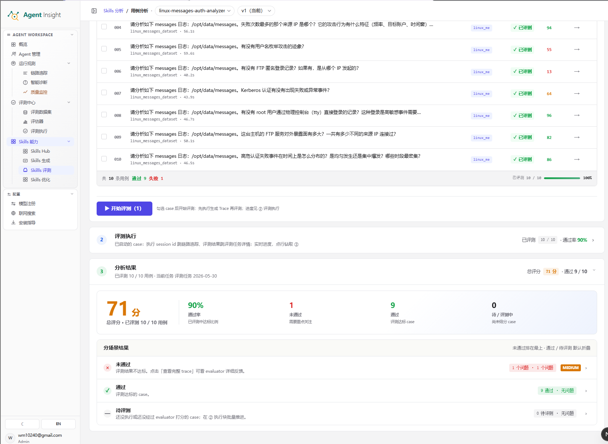

# 用例分析

用例分析验证某个 Skill 版本在真实任务中的表现，重点回答：

- 最终结果是否完成用户目标。
- 执行轨迹是否稳定、合理并正确使用 Skill。
- 低分问题集中在哪些 Case。

## 创建用例实验

实验记录的删除入口位于最右侧“操作”列；结果页中，每个 Case 的删除入口也位于最右侧“操作”列。运行中的 Case 显示“停止并删除”，运行结束后显示“删除”。删除只影响本次实验，不删除原数据集和共享 Trace；只分析已有 Trace 时不终止原业务 Agent。未确认退出的执行会显示“停止待确认”，不会把取消算成评测失败。

更新客户端后，生成 Trace 的执行状态会保存在执行机上；客户端重启会核查并清理遗留进程，确认退出后“停止待确认”自动消失。升级前未保存进程记录的历史任务会提示无法确认，需要先核查执行机进程。

1. 在工作台顶部选择目标正式版本。
2. 打开 **Skill 实验**。
3. 点击 **新建用例实验**。
4. 选择待执行 Agent，并按需选择评测数据集。
5. 在第 2 步选择 Trace 来源。
6. 确认预期答案和评估上下文。
7. 选择评估器并开始实验。

第 1 步选择或更换数据集后，第 2 步默认展示 **生成 Trace**；清空数据集后默认展示 **选择 Trace**。也可手动切换到已有 Trace，返回步骤时保留该选择。

## 两种 Trace 来源

### 选择已有 Trace

适用于复盘真实调用：

- 按 Agent、时间、标签或关键字筛选 Trace。
- 至少选择一条 Trace；也可启用监听模式，自动接收该 Agent 后续上报的 Trace。
- 第 3 步可手工标注参考答案，或从数据集按任务输入匹配参考答案和 Tool/Skill 目录。

选择已有 Trace 不会重新运行 Agent，评估的是已经发生的执行。

### 生成新 Trace

适用于标准数据集回归：

- 第 1 步必须选择包含 Case 的数据集。
- 第 2 步选择在线运行主机、模型、需要执行的 Case，并设置 **Agent 单次执行上限**。
- 系统在当前 Skill 版本上下文中重新运行 Agent。
- 第 3 步检查本次实验冻结的数据集预期答案快照。
- 每个 Case 的 **Agent 单次执行上限**默认是 600 秒，可配置为 30～3600 秒；该上限只约束单次 Agent 执行，不是整个实验的总时长，Agent 完成后才进入所选评估器的独立评测流程。选择已有 Trace 时不会重新执行 Agent，因此不显示该配置。

生成 Trace 的结果更适合版本回归，因为输入和运行配置更容易固定。

生成 Trace 会实际下发到所选主机，使用所选 Agent 和运行模型，不再使用平台设置中的默认模型替代。当前 Skill 版本隔离执行需要升级并重启 OpenCode 客户端；旧客户端或其他尚不支持版本隔离的平台会明确拒绝，不能静默回退。平台默认表示使用该客户端的默认模型，不是服务端默认模型。

每次执行使用冻结的 Skill 文件快照和独立工作目录，同一客户端的 Case 排队执行。模型连接失败、没有有效输出，或 Trace 记录的模型与所选模型不一致时，判为执行失败，不进入评分。“重新执行”沿用冻结的执行目标与 Skill 快照；“重新评测”只复用已有 Trace。运行模型负责生成回答，评估模型由各评估器独立配置。

## 默认评估器

用例分析会优先带入：

- **Agent 任务完成度**：评价最终输出是否完成目标。
- **Agent 轨迹质量**：评价规划、调用和中间过程。

还可以按数据条件选择其他预置或自建评估器。依赖参考答案或 Tool/Skill 目录的评估器，只有全部 Case 满足前置条件时才可用。

## 结果页

  

页面主要区域包括：

### 核心指标

统计数量、执行进度和评分使用统一的紧凑字号；配置值与区块标题保持一致，标签和辅助说明使用同一字号，便于上下对照。

- **执行成功 / 执行失败**：按 Case 对应的 Agent 执行项统计。连接错误、模型鉴权错误及无模型输出会计入执行失败，并跳过评分。
- **评测成功 / 评测失败**：每个执行项对应一个聚合评测项；多个评估器只决定该项是否成功，不扩大评测项总数。Agent 执行失败的项单列为 **未评测**，不计入评测失败；评估器正常结束但没有分数的项单列为 **未计分**。明细保留执行错误码、失败原因或未计分说明。
- **任务结果分**：只来自已选结果类评估器，不用综合分或轨迹分补位；未选择时显示“未评测”。
- **轨迹质量**：只来自已选轨迹类评估器，未选择时显示“未评测”。
- **当前结论**：实验数据完成后给出的可用性提示。仅评轨迹质量时显示“轨迹评测完成”，不推导任务结果或整体可用性。

截图示例中 6/6 个评估结果已齐，任务结果分为 97.5，轨迹质量为 89.0，当前结论为“可使用”。

### 实验进度

OpenCode 客户端实时捕获模型错误：鉴权/配置错误立即失败；连接故障最多允许一次重试，再次失败或首次错误后 10 秒未恢复输出便终止。没有明确错误信号时保留默认 90 秒首响应超时。客户端已结束的模型错误、无输出或首响应超时不会再被 Skill 编排自动完整执行两遍；修复模型配置后可手动重新执行。更新此机制需升级并重启执行客户端。

客户端为每次执行单独启用原始事件插件，捕获 CLI 未打印的重试信号；只读取当前根 Session，不把用户输入当作模型活动，不改变冻结 Skill、模型或执行权限。OpenCode 最多有 120 秒完成插件初始化并创建根会话，首响应的 90 秒兜底从会话创建后计时；本次执行上限仍按创建时的配置生效。通道确实无法就绪时会显示明确错误。

分别展示 **用例执行**和**结果评测**两条进度，选择已有 Trace 时第一条改为 **Trace 就绪**。每条进度按“已结束 / 总数”统计执行项，多个评估器不会增加分母；一个评估器失败但其他评估器仍在运行时，该评测项仍未结束。执行结束后评测进度继续更新，不再把用例人为划分为第一批和剩余批次。

100% 表示处理结束，包含失败、未评测和未计分项，不代表全部成功。实验结束后会明确提示失败或未计分项；最终指标在全部预期结果收敛后确认。

### 已冻结配置

页面保留“配置主机 / 运行模型”，不额外展示实际运行主机、实际运行模型或评估模型卡片。后端仍校验 Trace 中的实际模型，缺失或与所选模型不一致时不进入评测。历史实验若选择模型与实际模型不符，会显示“配置不一致”，保留原输出及评分，但不能当作所选模型的结果。未保存真实执行目标的旧实验需要重新创建，不能通过重新执行继续使用服务端默认模型。

记录 Skill、Agent、数据集、Trace 来源、评估器和创建实验时所选的 Trace 生成主机 / 模型；选择已有 Trace 时主机 / 模型显示“不适用（复用已有 Trace）”，没有关联数据集时显示“未关联数据集”。生成 Trace 的旧实验未保存主机 / 模型选择时仍显示“—”。

### Case 与评估明细

Case 与评估明细默认展开，执行过程中也可查看；可点击 **收起 Case 与评估明细**手动收起，再点击 **查看 Case 与评估明细**重新展开。明细包括：

- 实验状态、Case 数、评估器数和完成/失败数量。
- 综合均分与评估器分解。
- 每条 Case 的输入、参考输出、实际输出和结果/轨迹得分。
- **详情**用于查看单条证据与评分点。
- 操作按钮会根据失败阶段显示 **重新评测** 或 **重新执行**。

尚未产出得分时，得分列按实际阶段显示 **等待执行 → 执行中 → 待评测 → 评测中**。Agent 执行期间不会显示“评测中”。

选择已有 Trace 时，明细直接显示已有 Case 的输入、参考输出、实际输出和评测结果，不等待新的 Agent 执行。未开始评分显示“待评测”，评估器实际运行后才显示“评测中”；失败和正常结束但未返回分数分别显示“失败”和“未计分”。“详情”打开该 Case 的真实评测记录。

已有 Trace 的操作为 **重新评测**：有失败项时只重评失败评估器；全部评估器完成后，确认即可重新评测当前 Case 的全部已选评估器，不重新运行 Agent。排队或运行中不能重复提交，缺失结果行时不把成功项误当成失败项重试。删除使用该实验中的真实 Case，实验列表数量随之更新。

评估器失败且已有 Trace 时，**重新评测**只重跑失败或缺失的评估器，复用原 Agent 执行和 Trace；Agent 执行失败或 Trace 不可复用时，**重新执行**会重跑 Agent，成功后再运行全部已选评估器。已经成功的 Case 主动重试会先要求确认，因为新结果将替换当前执行结果与评分。提交失败时，原因会直接显示在当前行。

生成 Trace 的实验已经完成、失败或取消后，操作列以实验终态和已产出的有效得分为准恢复重试入口；历史运行状态即使没有及时收敛，也不会继续显示“执行中”或阻止重新执行。选择已有 Trace 的实验仍使用“重新评测”，已取消的实验不开放重评。

删除单个 Case 后，实验记录中的 Case 数和结果页明细会同步减少；原数据集中的 Case 保留。

## 结果解读

| 结果分 | 轨迹分 | 常见判断 |
| --- | --- | --- |
| 高 | 高 | 结果与执行过程都稳定，可继续扩大回归集 |
| 高 | 低 | 答案暂时正确，但过程不稳定或工具使用不合理 |
| 低 | 高 | 流程基本正确，但任务口径、知识或最终表达不足 |
| 低 | 低 | 先查看低分 Case 和 Trace，再判断是 Skill、数据还是运行环境问题 |

不要只看综合均分。结果类和轨迹类评估器失败时应分别定位。

## 下一步

- 返回实验入口：[Skill 评估与实验](./overview)
- 检查是否正确触发：[触发分析](./trigger-analysis)
- 比较两个版本的真实收益：[A/B 测试](./ab-test)
- 根据低分 Case 生成候选：[Skill 优化](../optimize)

实验结束不等于执行成功。有失败项时显示“实验失败”或“已结束，存在失败项”；没有有效分数时显示“暂无评分结论”。OpenCode 失败 Trace 保留结束时间和错误信息，并标为失败。历史错误数据不会仅凭输出包含 `Connection error` 自动改写；修复模型连接后可重新执行验证。
