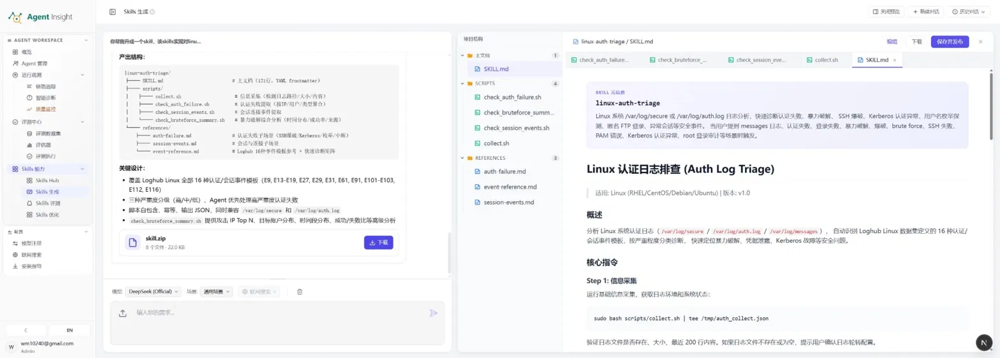

# Skills 生成

Skills 生成现在从「持续优化 → Skill」对话工作台左侧的 **生成一个 Skill** 开始，用于把自然语言需求转换为结构化 Skill 包。旧生成页在兼容期继续可用。

它面向这样的场景：你已经知道希望 Agent 具备什么能力，但还没有现成的 `SKILL.md`、脚本和参考文档，希望平台直接生成一套可预览、可编辑、可发布的 Skill 工件。

在 Skill 工作区中，它与其他页签的关系是：

- **Skills Hub**：管理和复用已生成的 Skill
- **Skills 生成**：从需求生成新 Skill
- **Skills 评测**：验证 Skill 的质量与效果
- **Skills 优化**：基于评测结果持续迭代

完整链路通常为：**生成并应用质量规则 → 查看工作快照 → 用户确认发布 → 实验 → 优化候选 → 复测 → 再发布**。

<p align="center">
  
</p>

## 核心能力

Skills 生成用于将需求转换为标准化 Skill 包，面向 Skill 的生成、修订、导出与发布，产出内容包括主文档、脚本和参考材料。

- **自然语言生成 Skill**：通过需求描述直接生成完整 Skill 包
- **标准化三层结构**：自动组织 `SKILL.md`、`scripts/`、`references/`
- **关键设计摘要**：生成后给出覆盖范围、分级策略、脚本设计等说明
- **模型选择**：支持选择底层生成模型
- **场景选择**：支持按业务场景调整生成策略
- **联网搜索增强**：按需引入外部资料，提升专业准确性
- **下载技能包**：导出完整 `skill.zip`
- **确认后发布**：生成完成只形成工作快照；平台按当前文件 hash 完成静态评估且无高风险问题、用户二次确认后，才追加正式版本。评估中、结果过期或存在 `high` 问题时发布按钮不可用；门禁未通过时可点击 **AI 修复问题**，让优化 Agent 按问题清单修改当前快照并自动复验
- **对话式迭代**：支持在同一会话中持续补充需求并生成新版本

## 使用方式

使用 Skills 生成时，通常按以下顺序完成：

### 1. 配置生成条件

生成前可指定以下条件：

- **模型**：决定底层生成能力
- **场景**：决定生成策略和表达风格
- **联网搜索**：当任务依赖公开资料、规范或外部知识时开启

前提是系统中已有可用模型；联网搜索属于可选增强能力。

### 2. 提交需求

需求越具体，生成结果越稳定。建议至少说明：

- **目标能力**：Skill 要解决什么问题
- **适用环境**：平台、系统、版本、技术栈或部署条件
- **覆盖范围**：要包含哪些子场景或异常类型
- **输出形式**：希望输出为 Markdown、JSON 或分步骤结果
- **约束条件**：是否要求自包含、幂等、只读、无额外依赖等

示例：

> 生成一个 Linux 认证日志排查 Skill，覆盖 SSH 暴力破解、Kerberos 异常等场景，脚本需自包含、输出 JSON，并兼容 `/var/log/secure` 与 `/var/log/auth.log`。

### 3. 核对生成结果

生成完成后，重点核对以下内容：

- `SKILL.md` 是否准确表达目标、触发条件和执行方式
- 脚本与参考文档是否齐全
- 关键设计摘要是否覆盖所需能力范围和策略
- 产出结构是否满足实际使用要求

### 4. 修订、下载或发布

如果结果需要调整，可以继续补充需求迭代生成，或直接编辑已有内容。

确认可用后，可执行两类后续动作：

- **下载**：导出 `skill.zip`，用于本地部署或离线分发
- **保存并发布**：发布到 Skills Hub，供团队检索和复用

发布后，通常还会进入 Skills 评测和 Skills 优化，形成持续改进闭环。

## 产出规范

Skills 生成遵循统一的三层结构：

```text
<skill-name>/
├── SKILL.md
├── scripts/
│   ├── collect.sh
│   └── ...
└── references/
    └── *.md
```

### `SKILL.md`

- Skill 主文档
- 通常包含 YAML frontmatter、概述、适用范围、触发方式和核心指令
- 是 Agent 理解并执行该 Skill 的主入口

### `scripts/`

- 可执行脚本目录
- 设计目标通常包括自包含、幂等、结构化输出
- 便于 Agent 直接调用，并对结果做进一步解析

### `references/`

- 参考文档目录
- 用于沉淀领域知识、事件说明和场景模板
- 为主文档和脚本提供背景支撑

## 示例走查：`linux-auth-triage`

以下示例体现了一个典型的 Skill 生成结果：

- **技能名**：`linux-auth-triage`
- **用途**：Linux 认证日志排查
- **适用环境**：Linux，兼容 RHEL、CentOS、Debian、Ubuntu
- **版本**：`v1.0`
- **产出规模**：8 个文件，约 22.0 KB

目录结构示例：

```text
linux-auth-triage/
├── SKILL.md
├── scripts/
│   ├── collect.sh
│   ├── check_auth_failure.sh
│   ├── check_session_events.sh
│   └── check_bruteforce_summary.sh
└── references/
    ├── auth-failure.md
    ├── session-events.md
    └── event-reference.md
```

该结果体现的功能特征包括：

- 覆盖多个认证失败和会话异常场景
- 按严重度分级，优先处理高风险事件
- 脚本自包含、幂等、输出 JSON
- 兼容主流 Linux 认证日志路径
- 支持对攻击来源、账户分布、时间分布和成功率做聚合分析

核心指令示例：

```bash
# Step 1: 信息采集
sudo bash scripts/collect.sh | tee /tmp/auth_collect.json
```

## 如何写出高质量需求

高质量生成依赖高质量输入。建议至少写清楚五类信息：

- **目标能力**：要解决的核心问题
- **适用环境**：平台、系统、版本或部署条件
- **覆盖范围**：需要覆盖的子场景或异常类型
- **输出形式**：例如 JSON、Markdown、分步骤报告
- **约束条件**：例如自包含、幂等、只读、不依赖额外安装

反例：

> 写个排查日志的脚本。

正例：

> 生成一个 Linux 认证日志排查 Skill，覆盖 SSH 暴力破解和 Kerberos 异常，脚本需自包含、输出 JSON，并兼容 `/var/log/secure` 和 `/var/log/auth.log`。

## 最佳实践

- **先定义能力，再补细节**：优先生成核心能力，后续逐轮补充边界和子场景
- **优先写清边界**：明确适用条件、禁止项和输出要求
- **按需开启联网搜索**：仅在确实依赖外部资料时启用
- **发布前逐文件复核**：尤其关注涉及系统权限、日志读取和外部命令的脚本
- **生成后继续评测与优化**：将生成结果纳入标准闭环，而不是停留在草稿状态

## 常见问题

### 生成的 Skill 可以直接使用吗？

可以下载并使用，但建议先人工复核脚本内容、权限操作和边界条件，必要时再通过 Skills 评测验证质量。

### 生成结果不满意怎么办？

可以在同一对话中继续补充需求迭代生成，也可以直接编辑单个文件，无需从头开始。

### 下载 和 保存并发布 有什么区别？

- **下载**：导出本地 `zip` 包
- **保存并发布**：将 Skill 发布到 Skills Hub，供团队检索和复用

### 更换模型或场景会影响结果吗？

会。不同模型和场景配置会影响生成结果的结构、表达风格和专业程度。

### 可以生成多文件、多脚本的复杂 Skill 吗？

可以。复杂 Skill 通常会同时生成主文档、多个执行脚本和若干参考文档。

## 术语说明

- **Skill**：让 Agent 具备某项专业能力的标准化工件
- **`SKILL.md`**：Skill 主文档，定义元信息、概述和核心指令
- **`scripts/`**：Skill 的可执行脚本目录
- **`references/`**：Skill 的参考文档目录
- **YAML frontmatter**：`SKILL.md` 顶部的结构化元信息
- **Skills Hub**：Skill 的管理与复用中心

## 下一步

- 想管理已生成的 Skill： [Skills 管理](./manage)
- 想验证生成结果质量： [Skills 评测总览](./evaluation/overview)
- 想继续迭代 Skill： [Skills 优化](./optimize)
- 想回到 Skill 工作区总览： [持续优化 · Skill](./index)
