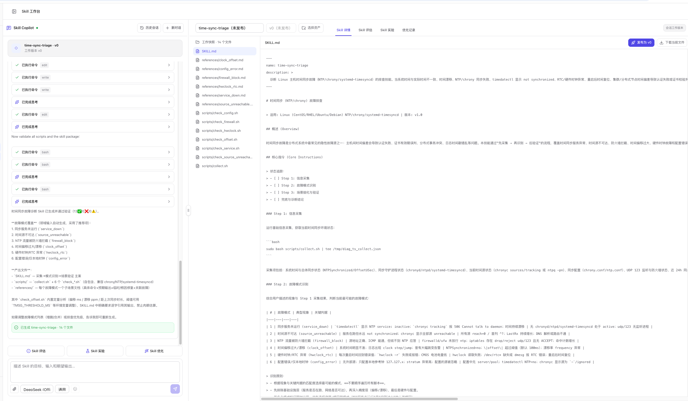

# Skill 生成

Skill 生成已经集成到一站式工作台。生成对话位于左侧 **Skill Copilot**，生成的文件立即成为当前会话的工作快照，并显示在右侧 **Skill 详情**；随后可直接运行静态评估、实验和优化，无需把结果转移到其他页面。

## 开始生成

1. 进入 **持续优化 → Skill**。
2. 新建一个工作台会话。
3. 点击 **生成一个 Skill**。
4. 在输入框中描述 Skill 的目标、输入、输出、适用边界和安全约束。
5. 按需上传参考资料，选择模型、场景和联网搜索。
6. 发送需求并根据 Copilot 的澄清问题补充信息。

Copilot 会持续展示思考过程、工具调用、问题确认和文件生成状态。任务在后台运行时可以保留当前会话，完成后工作台会同步最新文件。

## 输入区功能

- **上传参考资料**：给生成过程补充文档或样例；已上传文件会显示在输入框上方，并可移除。
- **模型**：选择本次生成使用的模型配置；未配置时使用平台默认模型。
- **场景**：当前支持 **通用** 和 **运维**，用于调整生成侧重点。
- **联网搜索**：配置 Tavily 后可启用；未配置时按钮不可用。
- **需求输入**：建议一次写清目标、触发条件、输入格式、预期输出、禁止事项和验收标准。

## 生成过程

生成不是一次性提交表单，而是可以连续修订的会话：

1. Copilot 先澄清目标、输入输出、适用边界与安全约束。
2. 根据需求生成 `SKILL.md` 以及必要的 `scripts/`、`references/` 文件。
3. 文件补丁实时写入当前工作快照。
4. 生成结束后，右侧绑定 Skill 名称和未发布版本。
5. 左侧出现 **Skill 评估**、**Skill 实验**、**Skill 优化**快捷入口。

如果结果不符合预期，继续在同一对话中说明需要修改的内容。历史生成消息、工具记录和当前工作版本都会保留在该会话中。

  

## 在 Skill 详情核对结果

生成完成后切换到 **Skill 详情**：

- 左侧文件树展示当前快照的全部文件，并优先显示 `SKILL.md`。
- 中间区域预览所选文件的完整内容。
- **下载当前文件**只下载正在查看的文件。
- 页面标明当前内容是未发布工作快照还是正式版本。

重点检查：

- Skill 名称和触发描述是否准确。
- 步骤、输入输出和失败处理是否完整。
- 脚本是否与 `SKILL.md` 的调用方式一致。
- 参考资料是否只保留必要内容。
- 是否包含不必要的权限、外部依赖或高风险操作。

## 静态质量门禁与发布

新工作台生成的未发布快照需要通过 **Skill 评估** 的静态质量门禁：

1. 打开 **Skill 评估**。
2. 点击 **开始评估**或**重新评估**。
3. 查看结构、描述、流程、安全和工程健壮性得分。
4. 若存在高风险问题，点击 **AI 修复问题**进入优化流程。
5. 修复后的候选会自动复验，但不会自动发布。
6. 门禁通过后，回到 **Skill 详情**点击 **发布为 vN**。

发布后，新版本立即成为激活版本；原版本和生成会话仍然保留。

> **Warning**
> 文件变化后，之前的静态评估会变为过期状态，需要重新评估最新快照。不要只根据旧评估结果发布。

## 需求写法建议

一个可执行的生成需求至少包含：

- **目标**：Skill 要解决什么问题。
- **触发条件**：什么时候应该使用，什么时候不应使用。
- **输入**：用户或 Agent 会提供哪些信息、文件或环境。
- **输出**：期望返回的结构、格式与判断口径。
- **步骤**：必须遵循的关键动作与顺序。
- **边界**：禁止事项、失败处理和权限要求。
- **验收**：什么结果代表 Skill 可用。

示例：

> 生成一个 Linux messages 日志认证异常分析 Skill。输入为日志目录，输出包括异常账号、来源 IP、事件计数和证据位置。先执行静态脚本提取事件，再做语义归因；禁止修改原日志。脚本失败时必须保留错误并给出人工检查建议。

## 生成、优化和发布的区别

| 操作 | 作用对象 | 结果 |
| --- | --- | --- |
| **生成** | 新建会话中的需求和参考资料 | 形成未发布工作快照 |
| **继续对话** | 当前工作快照 | 按补充要求继续修订 |
| **Skill 优化** | 已有 Skill 版本及评估/实验证据 | 形成独立候选版本 |
| **发布** | 门禁通过的工作快照或候选版本 | 写入正式版本并成为激活版本 |

## 下一步

- 了解工作台整体流程：[Skill 工作台](./index)
- 检查静态质量门禁：[Skill 评估](./evaluation/static-compliance)
- 验证真实运行效果：[Skill 实验](./evaluation/overview)
- 根据问题生成候选版本：[Skill 优化](./optimize)
