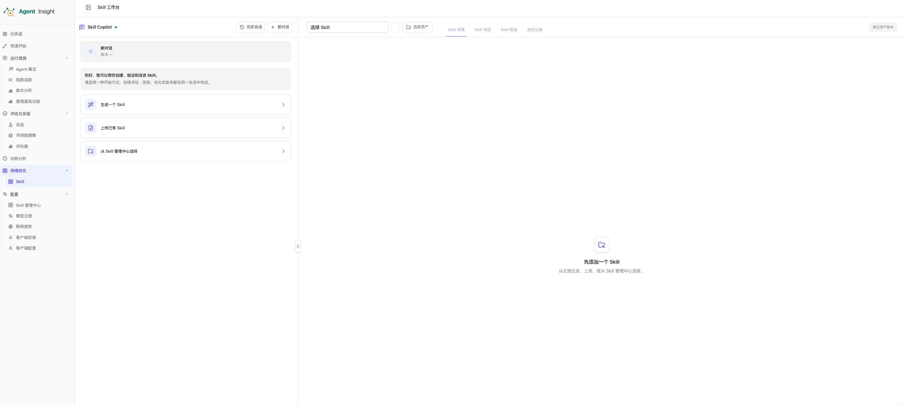

# Skill 工作台

Skill 工作台把一个 Skill 从创建到发布后的持续改进放在同一界面中完成。你不需要在“生成”“评测”“优化”几个独立模块之间搬运上下文；工作台会保存当前会话、Skill、工作版本以及后续任务状态。

## 工作台布局

页面由两个区域组成：

- **Skill Copilot**：位于左侧，用于生成 Skill、上传参考资料、接收补充要求、启动优化以及查看历史会话。
- **Skill 工作区**：位于右侧，始终围绕顶部选中的 Skill 和版本展示详情、评估、实验与优化记录。

中间分隔条可以拖动。页面刷新后，会话和已绑定的工作版本仍然保留。

右侧顶部包含：

- **Skill 选择器**：切换当前查看的 Skill。
- **版本选择器**：切换正式版本；激活版本会单独标记。
- **选择资产**：从 Skill 管理中心打开资产选择器。
- **Skill 详情**、**Skill 评估**、**Skill 实验**、**优化记录**：在同一版本上下文中切换工作阶段。

> **Note**
> 右侧可以临时查看一个独立资产版本，而不改变左侧会话正在处理的工作版本。出现黄色提示条时，应先确认当前操作针对的是“会话工作版本”还是“独立资产版本”。

## 三种开始方式

新建工作台会话后，可以选择：

1. **生成一个 Skill**：进入对话式生成流程，逐步形成未发布工作快照。
2. **上传已有 Skill**：导入本地 Skill 包，继续评估、实验和优化。
3. **从 Skill 管理中心选择**：绑定一个已有正式版本，直接开始评估或改进。

  

会话绑定 Skill 后，左侧会提供 **Skill 评估**、**Skill 实验** 和 **Skill 优化** 快捷入口。

## 一站式工作流

推荐按以下顺序完成一次闭环：

1. **创建会话并准备 Skill**
   - 描述需求生成 Skill，或上传、选择已有资产。
   - 工作台形成一个固定的工作快照。
2. **在 Skill 详情核对文件**
   - 查看 `SKILL.md`、`scripts/`、`references/` 等文件。
   - 按文件下载内容，确认当前版本和来源。
3. **运行 Skill 评估**
   - 静态质量评估检查结构、描述、流程、安全和工程健壮性。
   - 未发布快照必须通过质量门禁才能发布。
4. **运行 Skill 实验**
   - **触发分析**验证该触发时是否选中、不该触发时是否误选。
   - **用例分析**验证真实任务的结果与轨迹质量。
   - **A/B 测试**比较两个 Skill 版本或当前版本与无 Skill 基线。
5. **启动 Skill 优化**
   - Copilot 汇总静态评估、实验结果和人工反馈。
   - 系统生成候选版本，不覆盖当前正式版本。
6. **复验并发布**
   - 候选版本自动执行静态质量校验。
   - 通过门禁后可发布为下一版本并成为激活版本；原版本继续保留。

## 四个工作区页签

| 页签 | 主要用途 | 典型操作 |
| --- | --- | --- |
| **Skill 详情** | 查看当前快照或正式版本的全部文件 | 切换文件、下载、打开评估、发布工作快照 |
| **Skill 评估** | 检查 Skill 内容本身的质量 | 开始/重新评估、查看问题、AI 修复高风险问题 |
| **Skill 实验** | 验证 Skill 的运行效果 | 新建触发、用例或版本实验，查看当前版本的实验记录 |
| **优化记录** | 管理候选版本和版本差异 | 查看优化报告、修复阻断问题、放弃候选、发布新版本 |

## 会话与资产视图

一个会话固定绑定一个 Skill，并保存该会话当前的工作版本；每次在这个会话中发布优化结果，工作版本都会推进。工作区顶部的 **Skill** 和 **版本** 两级选择器控制右侧全部页签，但不会修改会话绑定。浏览内容与会话版本不一致时，工作台会显示提示；点击 **回到会话版本** 或重新打开该历史会话即可恢复。

左侧顶部提供 **历史会话** 与 **新对话** 按钮。历史会话以临时浮层展开，不占用主流程空间；点击空白处、选择会话、新建对话或按 `Esc` 都会收起。当前会话 ID 会写入 `/skills?sessionId=...`，复制地址或使用浏览器前进、后退时会恢复精确会话。生成和优化过程中的思考内容、命令输入及输出默认折叠为带状态图标的紧凑行。未绑定 Skill 的会话右侧保持空状态，不会自动展示其他资产。

## 工作快照、正式版本与候选版本

- **工作快照**：生成或上传后尚未发布的内容，可继续修改和评估。
- **正式版本**：已经发布到 Skill 管理中心的版本。
- **激活版本**：当前默认使用的正式版本。
- **候选版本**：优化产生、但尚未发布的下一版本。候选不会覆盖基线版本。

发布工作快照或优化候选后，新版本会立即成为激活版本，历史版本仍可在版本选择器和 Skill 管理中心查看。

## 历史会话与后台任务

历史会话用于恢复生成和优化的对话、消息、任务状态、绑定的 Skill 和当前工作版本。每条记录会显示绑定的 Skill 名称与工作版本；点击后，右侧立即回到该会话的当前工作版本。其他会话或管理中心后来发布的新版本不会让它自动跳版，右侧临时查看其他 Skill 或旧版本也不会改变左侧会话。

未发布的生成或上传草稿按所属会话隔离。生成完成后，系统自动把右侧切到该草稿的 Skill 详情。生成、评估、实验与优化一旦由服务端接受，就会继续在后台执行；切换页签、离开 `/skills` 或关闭页面不会取消任务。运行中的生成和优化会定期保存，候选被发布或放弃后，同一会话的其他页面也会重新读取服务端状态并最终收敛。

## 质量门禁

对于未发布快照和优化候选，静态质量评估是发布门禁：

- **质量门禁通过**：允许发布。
- **发现高风险问题**：发布按钮不可用，可启动 **AI 修复问题**。
- **正在评估**：等待固定快照评估完成。
- **文件已变化**：需要重新评估最新内容。
- **评估失败**：先处理评估错误，再重新运行。

生成来源为旧流程的历史快照可能沿用兼容门禁；新工作台流程以静态质量评估结果为准。

## 下一步

- 管理正式资产与版本：[Skills 管理](./manage)
- 通过对话生成工作快照：[Skill 生成](./generate)
- 了解评估与实验分工：[Skill 评估与实验](./evaluation/overview)
- 根据证据生成候选版本：[Skill 优化](./optimize)
