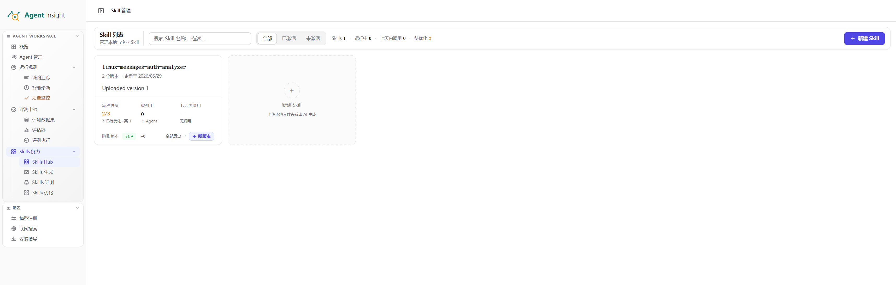
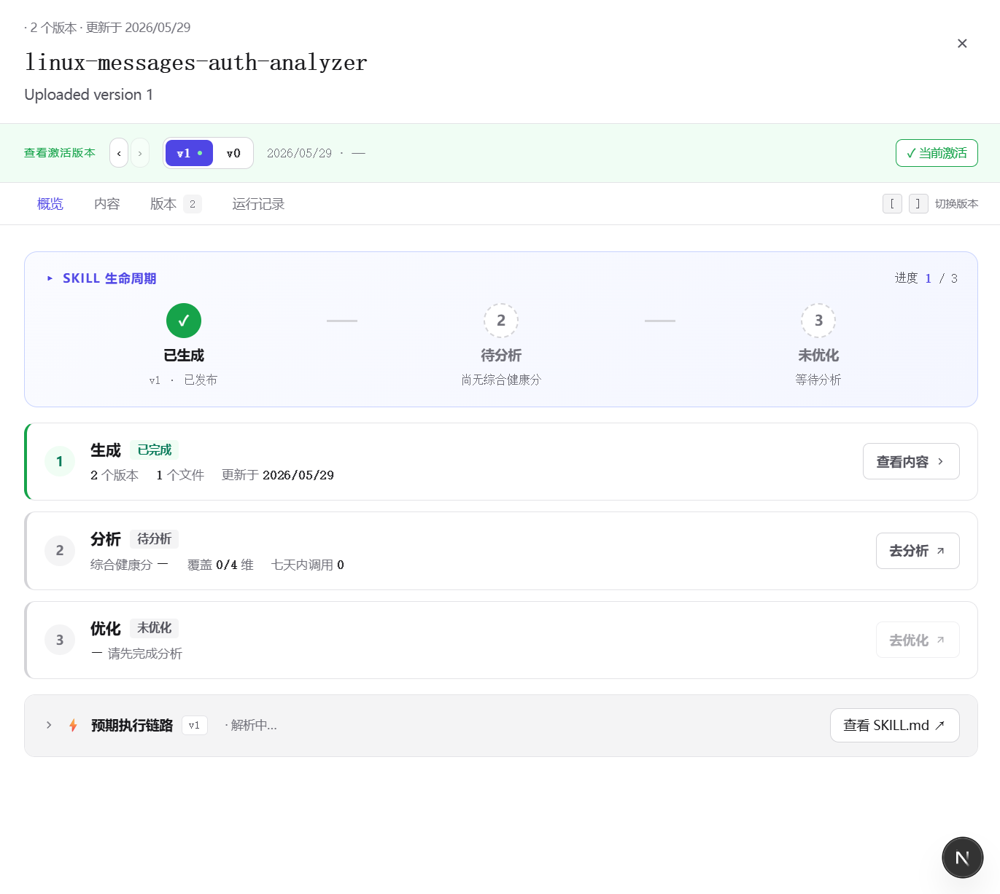
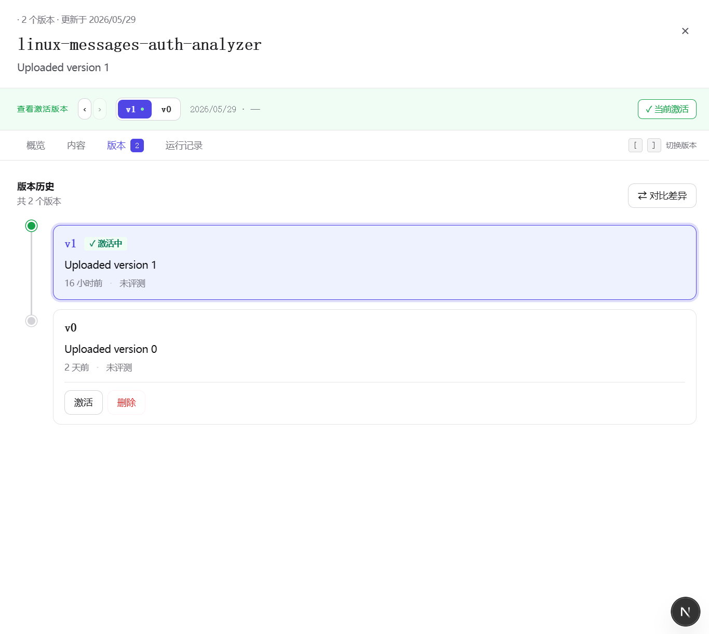
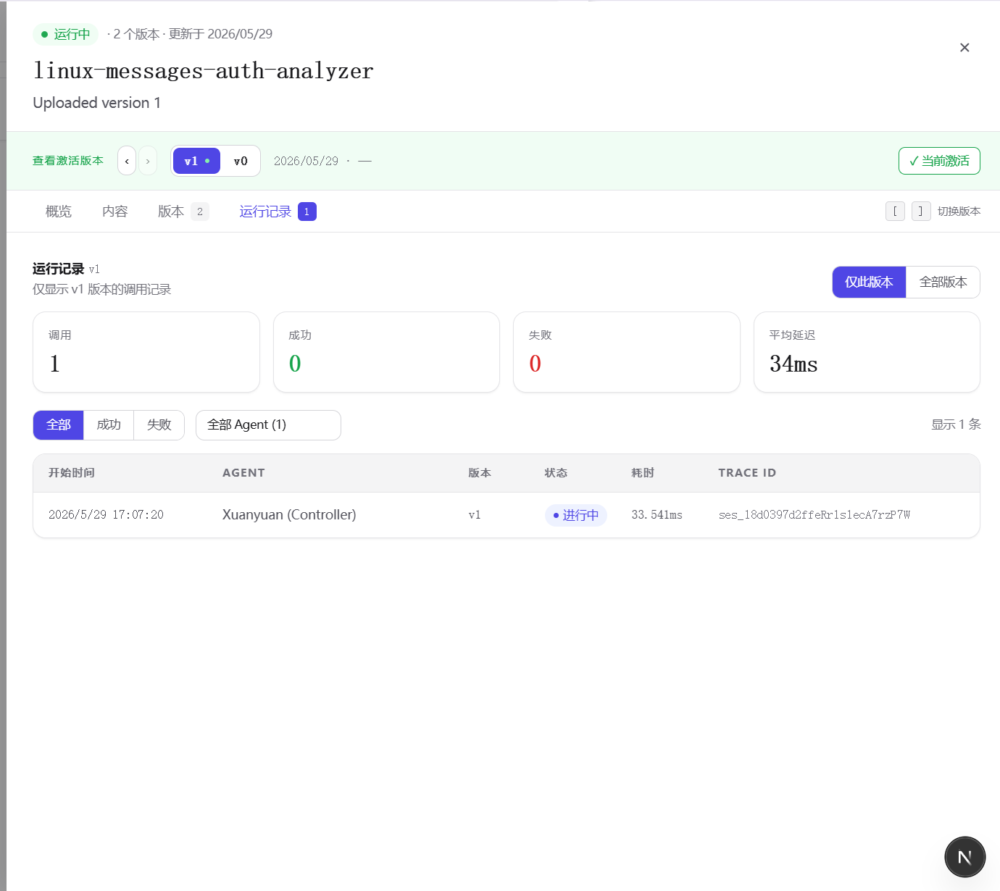

# Skills 管理

Skills 管理页是 Skill 资产的统一入口，用于查看当前 Workspace 下的 Skill、创建新 Skill、进入详情、管理版本，并衔接后续分析与优化流程。

<Note>
  Skills 管理页承担 Skill 资产展示、入口组织与版本管理职责。
  相关操作通常从该页面开始，包括新建 Skill、查看详情、核对激活版本，以及进入分析与优化流程。
</Note>

## 核心能力

- **查看 Skill 列表**：集中展示当前 Workspace 下的 Skill 资产
- **搜索与筛选**：按名称、描述或状态快速定位目标 Skill
- **新建 Skill**：支持本地上传现有 Skill，或通过 AI 生成新 Skill
- **查看详情**：进入某个 Skill 的详情抽屉，查看概览、内容、版本与运行记录
- **版本管理**：识别当前激活版本，并执行切换、对比、删除等操作
- **下载 Skill 包**：在内容页下载当前版本的 `zip` 包
- **衔接后续流程**：从管理页继续进入分析、优化等后续环节

## 使用方式

Skills 管理的常见使用流程如下：

### 1. 浏览与筛选 Skill 列表

列表浏览与筛选通常包括以下能力：

- **搜索框**：按 Skill 名称或描述搜索
- **状态筛选**：按当前状态筛选 Skill
- **Skill 卡片**：展示名称、版本数量、更新时间、来源或状态等摘要信息
- **新建入口**：点击右上角按钮创建新的 Skill

该区域用于完成 Skill 定位、状态判断与后续操作入口选择。

### 2. 创建新的 Skill

点击“新建 Skill”后，系统通常会弹出创建方式选择弹窗。当前常见方式包括：

#### 本地上传

适用于已有完整 Skill 文件夹的场景：

- 直接选择整个 Skill 文件夹上传
- 文件夹内通常应包含 `SKILL.md` 及其配套文件
- 选中文件夹后会立即开始上传，无需二次确认

上传时通常需要满足以下要求：

- 应上传完整 Skill 文件夹，而不是单个文件
- 文件夹命名通常只允许英文字符、数字与连字符

#### AI 生成

该入口会跳转至 [Skills 生成](./generate) 页面，用于通过自然语言需求生成结构化 Skill 包。

- 配置模型、场景与联网搜索等生成条件
- 提交需求并生成包含 `SKILL.md`、`scripts/`、`references/` 的 Skill 初稿
- 在生成页继续执行结果核对、修订、下载或发布

## Skill 详情

在列表中点击某个 Skill 后，页面通常会打开右侧详情区域。详情页主要围绕当前 Skill 的版本、结构与状态展开。

### 1. 顶部摘要区

顶部摘要区集中展示 Skill 名称、版本数量、更新时间、当前查看版本与激活状态等关键信息。

### 2. 概览

概览页用于展示当前 Skill 所处阶段与整体状态，例如：

- 是否已经生成或上传完成
- 是否已经完成分析
- 是否已经进入优化阶段
- 当前版本处于本地、已发布或其他状态

该区域主要用于形成对当前 Skill 生命周期状态的整体判断。

### 3. 内容

内容页用于查看当前版本的文件结构与具体内容，常见能力包括：

- 按目录查看 `references/`、`scripts/`、`SKILL.md` 等文件
- 在线预览文件内容
- 下载当前版本的 `zip` 包

该页面适合用于结构复核，确认主文档、脚本与参考材料是否完整。

### 4. 版本

版本页用于管理该 Skill 的历史版本。重点信息通常包括：

- 版本时间线或版本列表
- 哪个版本当前处于激活状态
- 每个版本的基础说明与状态
- 对比差异、切换激活版本或删除旧版本

当 Skill 经过多轮生成与优化后，版本页是判断当前应使用版本的关键入口。

### 5. 运行记录

运行记录页用于查看该 Skill 在实际运行中的相关记录，为效果观察与问题定位提供依据。

## 激活版本是什么意思

Skill 往往不止一个版本，但同一时刻通常只有一个“当前激活版本”真正对外生效或作为默认版本使用。

其含义如下：

- `v0`、`v1`、`v2` 是不同阶段的历史快照
- **激活版本** 是当前实际使用的版本
- 新版本生成或优化完成后，通常还需要显式切换为激活状态

在仅查看文件内容而未核对激活状态时，容易误判当前系统实际使用的版本。

## 适用场景

Skills 管理适用于 Skill 资产的检索、创建、详情查看与版本管理，常见场景包括：

- 确认某个 Skill 是否已存在
- 搜索并定位目标 Skill
- 查看文件内容、版本历史与激活状态
- 新建 Skill，并在本地上传与 AI 生成之间选择合适方式
- 从管理入口继续进入分析或优化流程

## 页面分工

- **Skills 管理**：查看资产清单、进入详情、管理版本
- **Skills 生成**：从需求起草新的 Skill
- **Skills 评测**：评估当前 Skill 的效果
- **Skills 优化**：基于结果继续迭代版本

常见路径如下：

`管理` → `生成` 或上传 → `查看详情` → `分析` → `优化` → `切换激活版本`

## 实践建议

- **优先核对激活状态**：避免将历史版本误判为当前生效版本
- **上传时保持目录完整**：确保 `SKILL.md`、脚本与参考文档一并提交
- **优先在内容页完成结构复核**：先确认文件齐全，再进入分析或优化
- **在版本页执行发布判断**：切换版本前应先核对状态与差异
- **将管理页作为长期资产面板**：除创建外，也应用于持续维护 Skill 生命周期

## 常见问题

### Skills 管理页和 Skills 生成有什么区别？

- **Skills 管理**：负责查看、创建、筛选、进入详情和管理版本
- **Skills 生成**：负责把自然语言需求转换成新的 Skill 包

### 上传 Skill 时应该选什么？

- 通常应选择整个 Skill 文件夹
- 文件夹内应包含 `SKILL.md` 与相关配套文件

### 为什么要关注激活版本？

- 因为同一个 Skill 可能有多个版本
- 只有激活版本才是当前真正对外生效的版本

### 内容页和版本页分别看什么？

- **内容页**：看当前版本有哪些文件、文件里写了什么
- **版本页**：看历史版本、当前激活状态以及版本切换关系

### 下载 `zip` 包有什么用？

可以把当前版本的 Skill 以完整压缩包形式导出，便于本地保存、离线查看或外部分发。

## 下一步

- 想从需求直接起草新 Skill： [Skills 生成](./generate)
- 想验证当前 Skill 的效果： [Skills 评测总览](./evaluation/overview)
- 想继续迭代现有版本： [Skills 优化](./optimize)
- 想回到 Skills 模块总览： [Skills 能力](./index)
