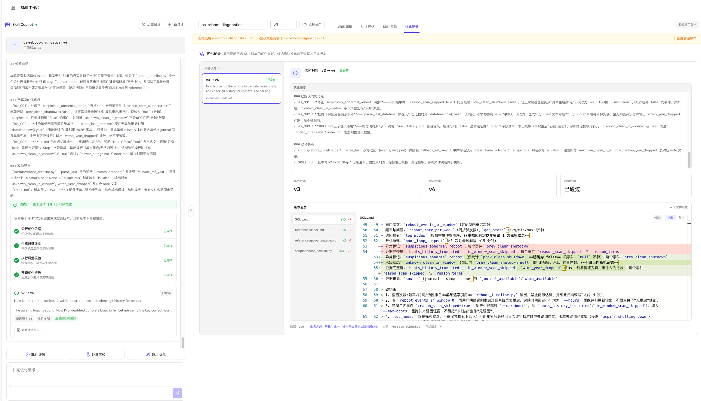

# Skill 优化

Skill 优化已经集成到同一个工作台会话中。左侧 **Skill Copilot**负责归并问题、修改文件和展示执行过程；右侧 **优化记录**保存每一次候选版本、静态质量校验、文件差异和发布状态。

优化始终以顶部选中的 Skill 版本为基线。系统生成候选版本，不会直接覆盖正式版本。

## 从哪里启动优化

可以从以下入口进入：

- 工作台左侧的 **Skill 优化**快捷操作。
- **Skill 评估**中发现高风险问题后，点击 **AI 修复问题**。
- 优化会话中继续输入新的人工反馈。
- **优化记录**中对失败记录点击 **重新优化**或**修复阻断问题**。

启动前应确认右侧顶部的 Skill 和版本。临时查看独立资产版本时，不会自动改变左侧会话基线。

## 优化依据

一次优化可以综合以下证据：

- 当前版本的静态质量问题。
- Skill 实验暴露的结果、轨迹或触发问题。
- 用户在对话中补充的明确修改要求。
- 之前优化记录中的阻断问题和版本差异。

Copilot 会先对问题归并、去重和排序，再决定哪些内容进入本轮修改。冲突项和暂不处理项会单独保留，避免把互相矛盾的建议同时写入 Skill。

## 标准流程

### 1. 确认基线

1. 在右侧顶部选择目标 Skill 和正式版本。
2. 回到会话版本，或从 Skill 管理中心把该版本绑定到当前会话。
3. 检查 **Skill 详情**中的文件是否是本轮期望的基线。

### 2. 启动优化

1. 点击 **Skill 优化**，或从静态评估点击 **AI 修复问题**。
2. 如有额外要求，在输入框中补充优化目标。
3. 提交后等待后台任务执行。

优化进度依次展示：

1. 汇总优化依据。
2. 生成候选版本。
3. 执行静态质量校验。
4. 整理优化报告。
5. 保存候选与版本差异。

### 3. 查看候选结果

优化完成后，对话中会出现结果卡片：

- 候选版本，例如 **v2 → v3**。
- 修改文件数量。
- 静态质量校验状态。
- **查看优化报告**、**发布为 vN**或**修复阻断问题**入口。

如果模型服务或执行过程失败，页面会标明“未生成候选”；如果候选已经生成但仍有高风险问题，则显示“质量校验未通过”以及阻断问题。

### 4. 在优化记录中评审

切换到右侧 **优化记录**：

- 左栏列出当前 Skill 版本相关的全部优化尝试及状态。
- 右侧展示优化摘要、基线版本、候选版本和质量校验。
- **版本差异**按文件展示新增、修改或删除内容。
- 阻断问题会附带依据和建议。
- 来源会话、来源类型和候选快照哈希用于追溯。

候选发布前不会写入正式版本。

  

截图中左侧会话正在处理 v4，右侧临时查看的是 v3 的独立资产记录，因此页面显示黄色版本提示。继续从会话基线操作前，应点击 **回到会话版本**。

### 5. 发布或放弃

- **发布为 vN**：确认后写入正式版本，并立即成为激活版本；基线版本仍保留。
- **放弃候选**：保留记录，但该候选不再用于发布。
- **修复阻断问题**：基于当前失败记录开始下一轮优化。
- **重新优化**：执行失败且未形成候选时，重新发起优化。

发布前会再次显示当前版本、目标版本和修改文件数。

## 优化记录状态

| 状态 | 含义 | 建议动作 |
| --- | --- | --- |
| **优化中** | 后台正在生成候选或校验质量 | 等待完成 |
| **质量规则已通过** | 候选已生成且静态质量门禁通过 | 查看 diff，决定发布或放弃 |
| **优化失败** | 未生成候选，或候选仍有阻断问题 | 查看失败原因并重新优化 |
| **已发布** | 候选已经成为正式版本 | 继续实验验证或开始下一轮 |
| **已放弃** | 候选被人工放弃 | 保留记录用于追溯 |

## 与 Skill 实验的关系

静态评估回答“Skill 写得是否规范”，实验回答“Skill 实际运行是否有效”，优化负责把这些证据转成候选版本。

推荐闭环：

1. 先运行静态质量评估。
2. 再通过触发分析、用例分析或 A/B 测试补充运行证据。
3. 根据已确认的问题启动优化。
4. 检查候选 diff 和静态质量门禁。
5. 发布后在新版本上重新运行关键实验。

> **Note**
> 静态质量门禁通过只说明候选符合内容和工程规则，不代表真实运行效果一定提升。重要版本应在发布前后使用同一数据集和评估器复测。

## 常见问题

### 优化会修改当前正式版本吗？

不会。优化生成独立候选，只有点击发布并确认后才会创建正式版本。

### 为什么没有“发布”按钮？

候选可能尚未生成、仍在校验，或者存在高风险阻断问题。打开优化报告查看质量状态。

### 为什么优化记录和当前对话内容不完全相同？

优化记录按顶部选择的 Skill 版本过滤；左侧对话还可能包含生成历史或其他轮次的上下文。

### 实验失败是否应该立即优化？

先确认失败来自 Skill，而不是数据集、模型、客户端或评估器配置。证据不充分时直接优化容易引入错误修改。

## 下一步

- 了解一站式工作流：[Skill 工作台](./index)
- 检查发布门禁：[Skill 评估](./evaluation/static-compliance)
- 运行真实效果验证：[Skill 实验](./evaluation/overview)
- 管理正式版本：[Skills 管理](./manage)
