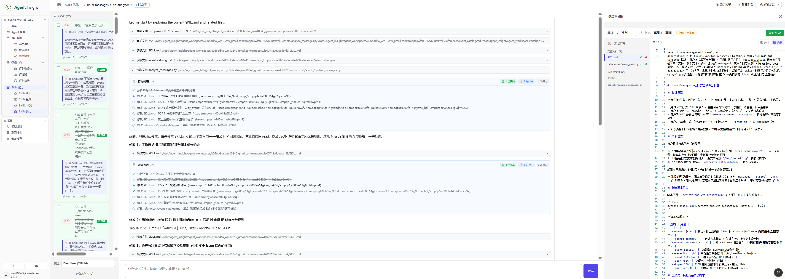

# Skills 优化

Skills 优化是 Agent Insight 在「持续优化 → Skill」工作区中的优化页签，用于把线上真实运行中暴露出来的问题，转化为对已有 Skill 的定向修改，并产出新的候选版本。

它不是从零重新写一个 Skill，而是基于现有版本、结合观测证据、通过自动化优化 Agent 完成一次可追踪、可评审、可发布的迭代。

> **Note**
> 优化适合放在分析之后，而不是替代分析。
> 先看到真实问题，再决定改什么，通常比“凭感觉重写一遍”更稳定。

- **适用对象**：Agent 运维、Prompt 工程师、平台管理员
- **模块路径**：`持续优化 -> Skill`，选择 Skill 与版本后点击左侧 **Skill 优化**；历史结果在顶部 **优化记录** 页签查看。

在 Skill 工作区中，它通常处于这条链路的末端：

`运行观测 -> 质量监控 / 智能诊断 -> Skills 优化 -> 新版本发布 -> 再观测`

在新工作台中，点击左侧 **Skill 优化** 会自动发送“根据这些问题优化 Skill”并立即执行，不需要再点击一次发送。系统先把当前版本所有未解决的静态、动态和触发问题做语义去重、冲突识别、优先级排序与 core/reference/backlog 路由，再将统一优化计划交给优化 Agent。右侧仍停留在点击前的详情、评估或实验页；切换页签乃至离开 Skill 页面也不会终止服务端任务。左侧按 **分析优化依据 → 生成候选版本 → 执行质量校验 → 整理优化报告** 展示持久化进度。每轮进度、候选摘要和操作按钮都紧跟在该轮对话后面，多次优化不会把旧结果挪到会话底部；恢复历史会话时也按原位置显示。Skill Copilot 与右侧工作区之间的分隔条可左右拖动，宽度会保留在当前浏览器。

用例分析和触发分析中只有明确标记为“可归因到 Skill”且带具体改进建议的评分点会进入优化台账。实验完成时系统自动同步；开始归并前还会补录该 Skill 版本已经完成的历史实验，因此升级前产生的建议也能参与后续优化。相同建议跨多个用例出现时会累计检出次数，同一实验重评会稳定更新原记录，不改变建议身份或复活已经解决的建议；最新触发分析全部通过时，旧的未解决触发问题会自动收口。质量校验通过且确实产生文件变更后，本轮实际执行的归并项及其同类来源会标记为已解决，下次不再参与归并；冲突项和待办项继续保留。若旧归并计划已经执行结束，而后续实验又产生了新建议，下一轮优化会重新归并；正在运行的候选不会被中途改写。

优化结果先保存为独立候选快照，不覆盖当前正式版本。修改完成后会执行编辑范围保护，以及结构、脚本真值和行为三层自验证；失败项由同一优化 Agent 进入 repair 循环。候选静态质量门禁发现有证据的高风险问题时，系统还会把问题、依据和修复建议自动交还同一优化 Agent，修复一轮后重新评估。自动修复后仍未通过时，完成卡片和优化报告会列出剩余阻断问题；点击 **修复阻断问题** 会从该候选继续处理，并自动携带上一轮问题。

如果模型服务在尚未产生任何文本或文件修改前连接中断，系统会自动重试一次。仍无法连接时，本轮会明确标记为 **优化执行失败**，不会误报成静态质量问题；点击 **重新优化** 可重新发起该轮请求。

优化记录按当前 `Skill` 聚合所有基线版本和来源会话，不再随顶部版本选择器过滤。每条记录使用 `v0 → v1`、`v1 → v2` 这样的标题说明基线与候选关系；点击会话候选卡片中的 **查看优化报告**，右侧会切换到该记录的基线版本、打开优化记录页签并选中对应报告。报告左侧选择历史候选，右侧查看逐文件差异、来源会话、质量阻断原因和后续动作。失败、放弃和已发布记录都会保留。静态质量规则通过后，左侧候选卡片和右侧优化报告都会显示 **发布为 vN**；确认后新版本立即成为激活版本，并在原工作台会话中继续后续优化。当前流程不要求新建实验复测。优化 Agent 运行时产生的外层临时工作目录不会进入候选快照，系统只保存最终 `SKILL.md` 所在技能根目录下的真实文件。

每次用户发起优化都会形成独立轮次。该轮的用户问题、Skill Copilot 执行进度、候选结果和错误状态使用同一个运行标识绑定并紧邻展示。因此，上一轮“质量规则已通过 / 已发布”与下一轮“分析优化依据失败”分别属于各自问题，不代表同一个候选同时成功和失败。界面区分三类状态：优化执行失败表示尚未生成候选；质量校验未通过表示候选已生成但仍有阻断问题；已发布表示该候选已经成为正式版本。旧记录如果缺少稳定关联标识，会单独显示为“未关联的历史优化记录”，不会被错误挂到某轮新对话下。

  

## 模块定位

Skills 优化负责把“发现问题”推进到“落地修复”。如果说 [Skills 评测总览](./evaluation/overview) 解决的是“哪里有问题”，那么 Skills 优化解决的是“基于这些问题，如何修改当前 Skill 版本”。

它特别适合以下场景：

- 已经有一个正在使用的 Skill
- 已经从分析或运行记录中拿到了较明确的问题证据
- 希望基于当前版本做定向修正，而不是从零重建
- 需要生成一个新的草稿版本，并在发布前做 diff 评审

## 核心术语

| 术语 | 含义 |
| --- | --- |
| **Skill（技能包）** | 一个结构化能力目录，通常包含 `SKILL.md`、`references/`、`scripts/` 等内容。`SKILL.md` 是定义 Agent 行为规则与流程的主文档。 |
| **可优化点（Optimizable Point）** | 系统根据历史会话、质量监控或智能诊断归纳出的待修复问题候选。每个点通常带有严重度、修复建议与证据来源。 |
| **优化 Agent** | 由已注册模型驱动的自动化执行体，负责读取 Skill 文件、理解问题、规划修改并生成草稿版本。 |
| **基线 / 草稿 / 版本** | 基线是本轮优化所依据的已存在版本；优化结果先形成草稿，评审通过后再发布成正式新版本。 |
| **diff（差异比对）** | 用于逐行查看基线版本与草稿版本之间的新增、删除和修改，是发布前评审的核心依据。 |
| **Session / Trace（会话 / 链路）** | 一次 Agent 运行的完整记录，是可优化点的证据来源，用于回溯问题是如何产生的。 |

## 页面结构

当前 Skill 工作台中的优化流程可以理解为四个区域：

### 1. 顶栏

顶部通常用于确认当前上下文和执行入口，常见能力包括：

- 当前 Skill 名称与版本标识
- 预览入口，用于打开多版本 diff 面板
- 新建对话，用于开启新一轮优化会话
- 优化记录，用于回看历史草稿或已完成轮次

### 2. 左侧可优化点列表

左侧面板用于承接系统已经发现的问题候选。每一条通常包含：

- 严重度标签，如 `HIGH`、`MEDIUM`、`LOW`
- 问题标题，对异常行为做简述
- `💡 修复建议`，给出推荐的整改方向
- 证据来源，例如某个会话或链路记录
- 勾选框，用于决定是否纳入本轮优化

这个区域决定了“本轮优化要处理哪些问题”。

### 3. 中间主工作区

中间区域用于展示优化 Agent 的执行过程，常见内容包括：

- 正在读取哪些文件，例如 `SKILL.md`、`references/*`、`scripts/*`
- 对问题的归类、合并与推理过程
- 结构化待办列表与当前进度
- 每一步实际修改了什么、原因是什么

这个区域的重点不是“看模型怎么想”，而是确认它有没有覆盖你选中的范围、有没有出现范围外改动。

### 4. 右侧文件与 diff 面板

右侧区域通常用于查看当前文件内容、修改结果和版本差异。完成一轮优化后，这里会成为发布前评审的主要入口。

## 标准操作流程

整个 Skills 优化流程通常可以分成六个阶段。

### 阶段 1：选择目标 Skill 与基线版本

进入页面后，先确认两件事：

- **目标 Skill**：本轮要优化哪一个 Skill
- **基线版本**：本轮修改以哪个已存在版本为起点，例如 `v1 当前`

这一步很重要，因为后续所有改动、草稿生成和 diff 对比，都会相对于这个基线版本展开。

开始前建议先确认：

- 当前线上激活版本是不是你准备优化的版本
- 是否存在更新但尚未核对过的版本
- 本轮是继续迭代最新版本，还是回到一个更稳定的旧版本

### 阶段 2：审阅可优化点，圈定优化范围

左侧「可优化点」面板会列出系统诊断出的候选缺陷。截图示例中，这些问题按卡片形式排列，并带有严重度与修复建议。

使用时建议这样处理：

1. 优先查看 `HIGH` 级问题，把高影响项先纳入范围。
2. 识别“同因不同表”的问题，避免一次选入太多表象重复的点。
3. 尽量按同一类逻辑、同一文件或同一根因分组处理，便于后续评审和回滚。

每条可优化点通常提供两类关键信息：

- **问题现象**：哪里表现不好
- **修复方向**：大致应该改哪些规则、步骤或约束

如果还能回到对应 Session 或 Trace 查看证据，判断会更稳。

### 阶段 3：配置执行参数并启动

在启动优化前，通常需要确认底部或页面内的执行参数：

- **模型（Model）**：驱动优化 Agent 的大模型，例如截图中的已注册模型
- **补充优化诉求**：手动补充本轮的额外要求或边界条件

补充诉求建议写成“问题 + 期望”的形式，例如：

- 当前 Skill 在边界查询上误触发较多，希望收紧触发条件
- 保留原有章节结构，只补充规则，不要整体改写
- 新增规则时同步检查 `scripts/` 中是否需要补充字段
- 输出格式统一为 Markdown 报告，避免自由发挥

不要只写“帮我优化一下”。方向越明确，结果通常越稳定。

### 阶段 4：观察优化 Agent 的执行过程

启动后，主工作区会实时展示优化 Agent 的执行轨迹。一个典型过程通常包含四步：

1. **探查（Explore）**：读取 `SKILL.md`、`references/`、`scripts/` 等文件，建立对当前 Skill 的理解。
2. **归类与合并（Analyze & Merge）**：把选中的问题按根因归类，合并重复或相近的修改目标。
3. **制定计划（Plan）**：生成待办列表与步骤顺序，让整轮优化可以追踪。
4. **落地修改（Edit）**：逐项修改文件，并解释改动原因。

这一阶段建议重点关注：

- 是否真的覆盖了你圈定的全部问题
- 是否错误合并了其实不属于同一根因的问题
- 是否出现了超出本轮范围的意外改动

### 阶段 5：预览多版本 diff 并评审

执行完成后，点击「预览」进入多版本 diff 面板，对草稿版本做发布前评审。

这里通常会看到：

- **基线（baseline）**：当前正式版本，例如 `v1 发布`
- **对比（compare）**：本轮生成的草稿版本
- **优化报告**：本轮修改内容的总结
- **变更文件清单**：哪些文件被改了、增删行大概是多少
- **未更改文件清单**：哪些文件没有动，帮助确认改动边界
- **diff 模式**：内联或并排查看

评审时建议重点核对：

- 新增规则是否真的对应已选问题
- 表述是否更明确，是否引入新的歧义
- 原有工作流有没有被破坏
- `SKILL.md` 以外的脚本或参考文档是否也需要同步修改
- 未更改文件是否确实不需要改动

### 阶段 6：确认并发布新版本

确认 Diff 且候选静态质量规则通过后，点击 **发布为 vN**。站内确认框会再次展示当前版本、目标版本与修改文件数；确认后，例如从 `v1` 发布为 `v2`。质量未通过、放弃、候选快照变化或基线版本冲突都不会改变当前激活版本。

发布后，新的 Skill 版本会成为后续运行与观测的基础。至此形成完整闭环：

`发现问题 -> 优化修复 -> 版本发布 -> 再次观测验证`

如果评审未通过，常见做法有三种：

- 在补充优化诉求中追加限制或纠偏要求，再让 Agent 二次修订
- 新建对话，重新开启一轮新的优化过程
- 回看优化记录，对比历史轮次后再决定是否继续

## 控件与参数速查

| 控件 / 参数 | 位置 | 作用 |
| --- | --- | --- |
| 版本标识 | 顶栏 | 指定本轮优化所依据的基线版本 |
| 预览 | 顶栏 | 打开或关闭多版本 diff 面板 |
| 新建对话 | 顶栏 | 开启新一轮优化会话 |
| 优化记录 | 顶栏 | 查看历史优化轮次与草稿 |
| 可优化点列表 | 左侧面板 | 展示系统诊断出的待修复问题候选 |
| 严重度标签 | 问题卡片 | 表示问题优先级 |
| 修复建议 | 问题卡片 | 给出推荐整改方向 |
| 会话或链路来源 | 问题卡片 | 提供问题证据来源 |
| 勾选框 | 问题卡片 | 决定该问题是否纳入本轮优化 |
| 模型 | 页面配置区 | 指定驱动优化 Agent 的底层模型 |
| 补充优化诉求 | 页面配置区 | 人工补充或纠偏本轮要求 |
| 待办列表 | 主工作区 | 展示优化 Agent 的计划与进度 |
| 基线 / 对比 | diff 面板 | 选择要对比的两个版本 |
| 变更文件 / 未更改文件 | diff 面板 | 帮助确认改动边界 |
| 内联 / 并排 | diff 面板 | 切换 diff 的展示方式 |
| 发布新版本 | diff 面板 | 将草稿固化为正式版本 |

## 最佳实践

- **小步迭代**：单轮只处理一组同类问题，评审更清楚，回滚也更容易。
- **优先处理高严重度**：先解决影响面最大的缺陷，再处理体验类和边界类问题。
- **让证据驱动修改**：优先依据评测、诊断和运行记录，而不是主观感觉。
- **善用补充诉求做人工兜底**：把自动诊断之外的约束显式写出来，不要依赖模型猜测。
- **发布前看清改动边界**：不仅看改了什么，也要看哪些文件没有改。
- **发布后回到评测与观测验证**：确认对应问题是否真的消失，再决定是否继续下一轮优化。

## 常见误区

- 没看分析结果就直接开始改
- 一次想同时修太多问题，导致 diff 难以评审
- 没确认基线版本，结果在错误版本上继续迭代
- 只盯 `SKILL.md`，忽略 `scripts/` 或 `references/` 也可能是根因
- 看到 Agent 有计划和解释，就默认它一定改对了，缺少最终 diff 复核

## 什么时候先不要继续优化

以下情况通常更适合先停下来复核，而不是继续叠加修改：

- 分析样本覆盖度还不足，结论不稳定
- 多轮优化后收益仍不明显
- 根因并不在 Skill，而在 Agent 编排、工具调用或外部系统
- 当前业务场景本身还在快速变化，继续打磨单个 Skill 的回报有限

## 下一步

- 想先定位问题证据： [Skills 评测总览](./evaluation/overview)
- 想查看和管理 Skill 资产： [Skills 管理](./manage)
- 想从需求重新起草 Skill： [Skills 生成](./generate)
- 想回到 Skill 工作区总览： [持续优化 · Skill](./index)
